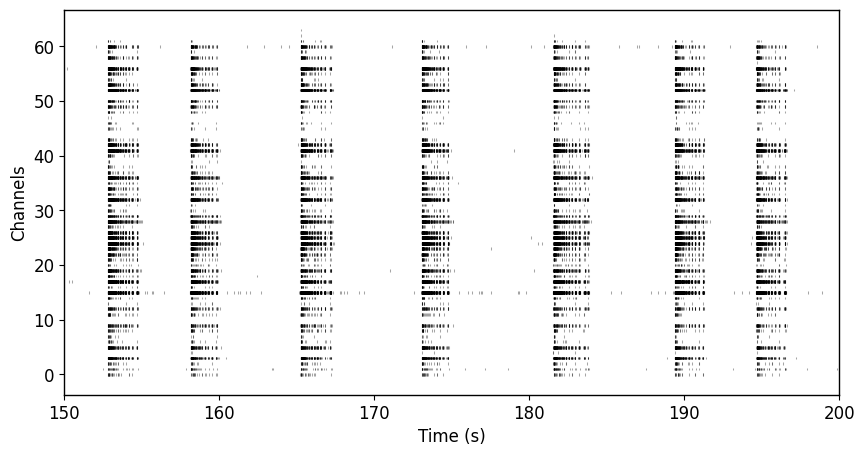

Data visualization is the graphical representation of information and data. By using visual elements like charts, graphs, and projections, data visualization provides an accessible way to see and understand trends, outliers, and patterns in data. In storytelling, this translates to a narrative that is driven by facts and figures, presented in a way that is both comprehensive and engaging.


## Choosing a visualization type
To successfully convey yo

## Elements of charts

### Layout (panels, subplots, facets)

### Aspect ratio

### Lines

### Points

### Colours

### Axes

### Symbols

### Legends

### Orientation

### Font


# Examples
## Creating raster plots

<details>
    <summary>Python</summary>
    
    ```python
    plt.figure(figsize=(10,5))
    plt.rcParams.update({'font.size': 12})
    plt.rc('axes', linewidth=1)
    plt.eventplot(raster, color='black', linelengths=0.5, linewidths=0.75, alpha=0.35);
    plt.xlim(150, 200)
    plt.ylabel("Channels")
    plt.xlabel("Time (s)")
    ```